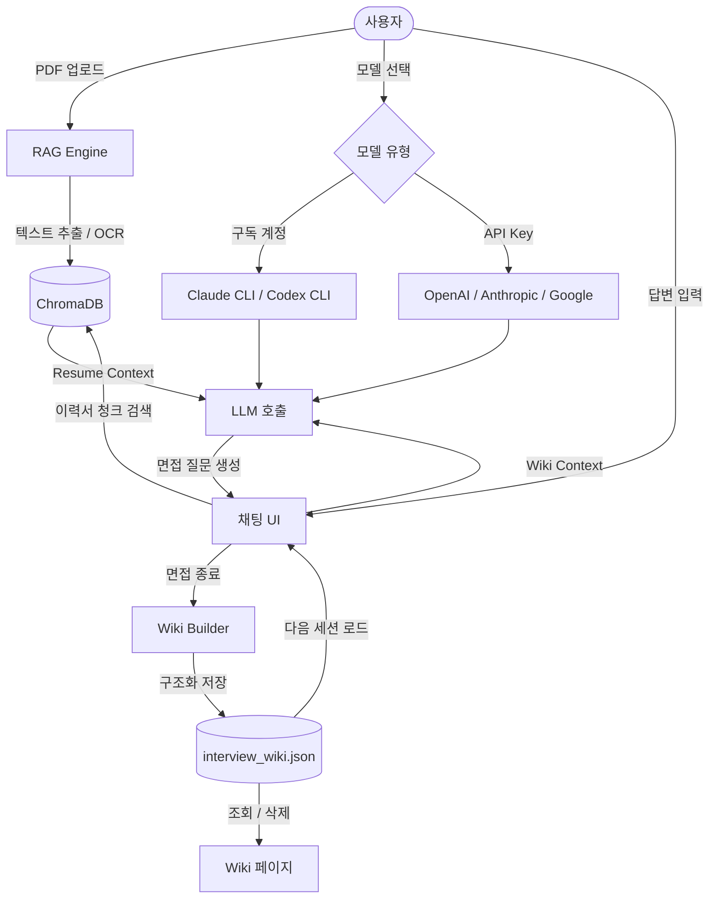

# 나만의 로컬 면접 AI

Andrej Karpathy의 LLM WIKI 개념을 기반으로 한 **로컬 설치형 면접 AI**입니다.

이력서(PDF)를 업로드하면 AI 면접관이 이력서 내용을 바탕으로 질문을 생성하고, 면접 대화를 누적해 본인만의 **Interview Wiki**를 자동으로 만들어줍니다.

---

## 주요 기능

- **이력서 기반 면접 진행** — PDF를 업로드하면 RAG(검색 증강 생성)로 이력서 내용을 참조해 질문 생성
- **이미지 PDF OCR 지원** — 스캔/이미지 기반 PDF도 Tesseract OCR로 자동 처리
- **Interview Wiki 자동 생성** — 면접 대화를 LLM이 분석해 경험, 기술스택, 강점, 약점, 미커버 토픽을 구조화
- **Wiki 영구 저장** — 로컬 JSON 파일로 저장되어 앱을 재시작해도 이전 면접 내용 유지 및 누적
- **구독 계정 지원** — Claude.ai 구독 또는 ChatGPT Plus 구독으로 API Key 없이 사용 가능
- **완전 로컬 처리** — API Key와 이력서 데이터는 외부 서버로 전송되지 않음

---

## 모델 선택 방법

총 두 가지 방식으로 사용할 수 있습니다.

### A. 구독 계정 사용 (API Key 불필요)

| 구독 서비스       | 필요한 CLI   | 모델 선택             |
| ----------------- | ------------ | --------------------- |
| Claude.ai 구독    | Claude Code  | `Claude (구독)`       |
| ChatGPT Plus 구독 | OpenAI Codex | `OpenAI Codex (구독)` |

**Claude.ai 구독 사용자**

Claude Code가 설치되어 있고 로그인된 상태라면 바로 사용 가능합니다.

```bash
# Claude Code 설치 확인
claude --version
```

**ChatGPT Plus 구독 사용자**

OpenAI Codex CLI를 설치하고 로그인합니다.

```bash
# Codex CLI 설치
npm install -g @openai/codex

# 로그인
codex login
```

---

### B. API Key 사용

`console.anthropic.com`, `platform.openai.com`, `aistudio.google.com`에서 발급한 API Key를 `.env` 파일에 입력합니다.

| 모델              | 발급처                                             |
| ----------------- | -------------------------------------------------- |
| GPT-4o            | [OpenAI Platform](https://platform.openai.com)     |
| Claude 3.5 Sonnet | [Anthropic Console](https://console.anthropic.com) |
| Gemini 1.5 Pro    | [Google AI Studio](https://aistudio.google.com)    |

```bash
cp .env.example .env
# .env 파일을 열어 해당 API Key 입력 (사용할 모델만 입력)
```

---

## 설치 방법

### 1. 사전 요구사항

- Python 3.14.3+
- [Tesseract OCR](https://github.com/tesseract-ocr/tesseract) (이미지 PDF 지원)
- [Poppler](https://poppler.freedesktop.org/) (PDF → 이미지 변환)

```bash
# macOS
brew install tesseract tesseract-lang poppler
```

### 2. 저장소 클론

```bash
git clone https://github.com/your-username/my-own-interview-ai.git
cd my-own-interview-ai
```

### 3. 가상환경 생성 및 활성화

```bash
# 생성
python -m venv venv

# 활성화 (macOS/Linux)
source venv/bin/activate

# 활성화 (Windows)
.\venv\Scripts\activate
```

### 4. 의존성 설치

`requirements.txt`에 Streamlit을 포함한 모든 패키지가 포함되어 있습니다.

```bash
pip install -r requirements.txt
```

### 5. 앱 실행

```bash
streamlit run main.py
```

브라우저에서 `http://localhost:8501`로 접속합니다.

---

## 사용 방법

1. **사이드바에서 모델 선택** — 구독 계정 또는 API Key 방식 중 선택
2. **이력서 업로드** — PDF 파일 업로드 (텍스트 PDF 및 이미지 PDF 모두 지원)
3. **면접 설정 입력** — 이력서 분석 완료 후 채팅창에 난이도와 분야 입력 (예: `5년차 백엔드`)
   - 난이도: `3년차` / `5년차` / `10년차`
   - 분야: `백엔드` / `프론트엔드` / `풀스택` / `데이터·AI`
4. **면접 진행** — 채팅창에 답변 입력
5. **Wiki 생성** — "면접 종료 & Wiki 생성" 버튼 클릭 시 대화 내용을 분석해 Wiki 자동 생성
6. **연속 면접** — Wiki는 로컬에 저장되어 다음 실행 시 자동 로드 및 누적

---

## 동작 과정


